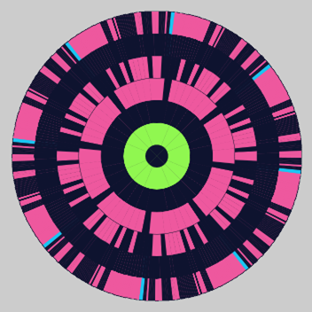
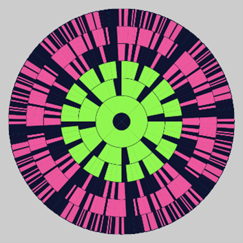

# MandalaCellularAutomata

This is a program for a cellular automaton that I created taking inspriation from from Conway's Game of Life, as well as mandala designs.

## The Grid Design

I designed a circular symmetrical grid to use as the base for my cellular automaton.

Because the grid is symmetrical, the state of the whole grid can be represented using only one section, or octant. A diagram of the indexing system for an octant is shown below:

Note that while this diagram only has 4 levels, the indexing system can be extended for more levels. My simulation will be using a circle grid with 7 levels.

### Terminology

The octant is always considered in its upright position (center at the bottom) when determining the relationships above and below. In other words, above means farther from the center while below means closer to the center.

Consider the following segment of the grid:

Cell X is directly below cell Y if and only if X’s top edge aligns with Y’s bottom edge  
e.g. in the diagram, cell D is both directly below cell A and directly below cell B

Cell X is directly above cell Y if and only if Y is directly below X  
e.g. in the diagram, cell A is directly above cell D, and cell B is also directly above cell D

Cell X is diagonally below cell Y if and only if X is in the level below Y, and X and Y share exactly one corner  
e.g. in the diagram, cell C is diagonally below cell A, and cell E is diagonally below     cell B

These relationships hold across boundaries of octants as well.

## The Rule Set

- If a non-central cell X is directly above a cell that is alive, then X has a 50% chance of getting the colour of that cell 
- If a non-central cell X is directly above a cell that is dead, then X has an 80% chance of getting the colour of the cell diagonally below it
- The central cell is randomly assigned a new colour

## Running the Simulation

The file with the code is called Mandala.pde and is located in the Mandala folder. To run the simulation simply open the file in Processing and run the file. 

Below are screenshots of the first few iterations during a run of my simulation:

## Emergent Effects

There are several effects that emerge from the simple rule set of my cellular automaton. For one, when playing the simulation, it appears as though the mandala is rotating side-to-side slightly. I will refer to this as the Twisting Effect. Interestingly, this emergent effect exists regardless of whether I allow for diagonal propagation or not. The Twisting Effect can be seen in my video demo of the simulation. 

Additionally, there are several structural patterns that often emerge. I have categorized several of them below. Each state of the mandala can have several of these structural patterns within it, and some structures can fit into more than one category.

#### The Flower:
This is one of the most common patterns that emerge in the mandala, and often appears within other patterns. Its structure is characterized by evenly spaced “petals” placed around 1 or more fully filled in levels. It can consist of just a single colour, or multiple colours. In order to be considered a true flower, each of the levels inside the petal level must be fully filled in with a single colour (though different levels may have different colours). The flower always occurs at the center of the mandala. 

 

#### The Gear:
The gear is similar to the flower; in fact, there is some overlap between the two categories, though they do have different identifying properties. The gear consists of a solid ring, with evenly spaced “teeth” (like petals) on the next level up. The gear differs from the flower in that it must be a single colour, that colour cannot fill all the way up to the center (there must be some other colour in the center), and there may be other patterns that exist inside the gear’s center. The most classic gears are ones with only small spaces between the teeth. Gears seem to appear most often in the default colour (or at least they are most noticeable in the default colour). 

 

#### The Snowflake:
The snowflake is also quite similar to the gear and flower. The difference is instead of having “petals” or “teeth” which are only on a single layer, the snowflake’s arms spread outwards to multiple layers, getting narrower with each layer. Similar to the gear, the snowflake must consist of just one colour.   

 

#### The Wheel:
The wheel consists of a series of T-shaped structures arranged around the circle. The top of the T does not need to be centered.  

 

#### The Spinning Hammer:
The spinning hammer is very similar to the wheel. The only difference is that the top section of each segment only extends out to one side.    

 

#### The Ring:
The ring can be subcategorized into two types: the full ring or the fragmented ring. The full ring is one or more levels that are fully filled with one colour. The levels immediately within and outside of the ring must not contain that colour. The fragmented ring is similar except the ring layer may have gaps in it. The fragments in the fragmented ring must be evenly spaced. 

 

#### The Cantor:
This pattern is characterised by a block of filled cells which branch into several skinnier “legs”. These legs may themselves branch into more legs. Legs may branch inwards, outwards, or in both directions. To me, this pattern resembles the cantor fractal, from which it gets its name. However, unlike the cantor fractal the branching does not need to be symmetrical. This pattern tends to occur in the outer layers of the mandala, but can occur in the inner layers as well.

 

#### The Tables:
This pattern can be considered to be a special case of the cantor where there are only legs, which are facing inwards. There may also be some smaller legs branching outwards, but they are not considered part of the pattern and must be small enough that the table shape appears to be the main unit.

 

####
These are only a subset of the many patterns that appear in my cellular automaton. I selected these patterns because I felt that they were interesting and distinct, and they occurred fairly frequently. While I have made some of these categories quite constrained, there are other variations and hybrids of these patterns. 

